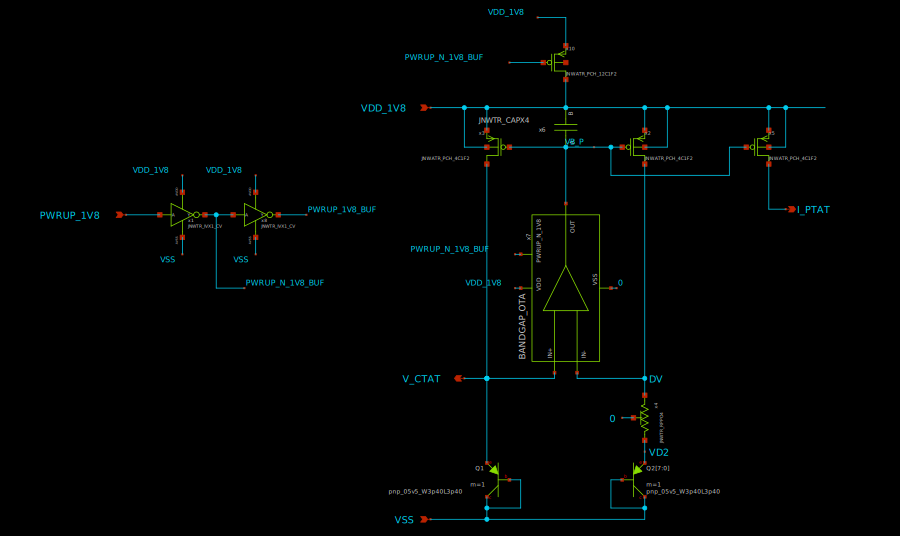
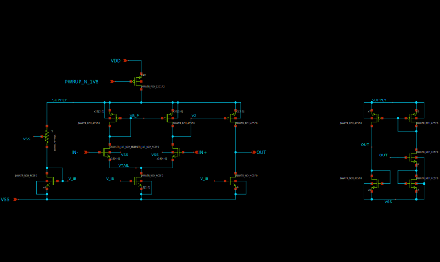
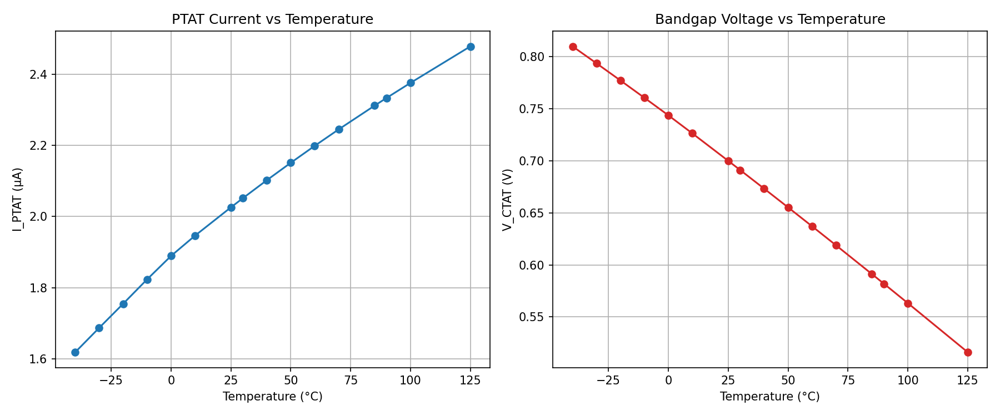

# Who

We are group 3 in the 2026 course of Advanced Integrated Curcuits.

# Why

To get an understanding of design of advanced integrated circuits in CMOS technology, and to get an overview of the cir>

# How

The course consistns of among other things a project divided into 5(6 if tapeout) milestones. The idea is to design a t>
below in the README the different milestones will get a short descriptions each.

# What

| What            |        Cell/Name |
| :----           |  :----:       |
| Schematic       | design/LELO_GR03_SKY130A/LELO_GR03.sch |
| Layout          | design/LELO_GR03_SKY130A/LELO_GR03.mag |

# Signal interface

| Signal       | Direction | Domain  | Description                               |
| :---         | :---:     | :---:   | :---                                      |
| VDD_1V8      | Input     | VDD_1V8 | Main supply                               |
| OSC_TEMP_1V8 | Output    | VDD_1V8 | Temperature dependent oscillation frequency|
| PWRUP_1V8    | Input     | VDD_1V8 | Power up the circuit
| VSS          | Input     | Ground  |                                           |

# Key parameters

| Parameter           | Min     | Typ             | Max     | Unit  |
| :---                | :---:   | :---:           | :---:   | :---: |
| Technology          |         | Skywater 130 nm |         |       |
| AVDD                | 1.7     | 1.8             | 1.9     | V     |
| Temperature         | -40     | 27              | 125     | C     |

# Milestone 1: The bandgap

The files for milestone 1 are uploaded on the main branch, under the folders design and then LELO_GR03_SKY130A.

The OTA is based on a two stage Miller OTA. The transistors were chosen for their low treshold voltage, as they worked with the set voltage.

The overhead bandgap curcuit was made from the standard bandgap design following the instructions in the AIC course.

The sizes for CTAT and PTAT were calculated using the formulas from the course.

# Layout
Layout for the top level bandgap:

Layout for the OTA:

The PTAT plots:

